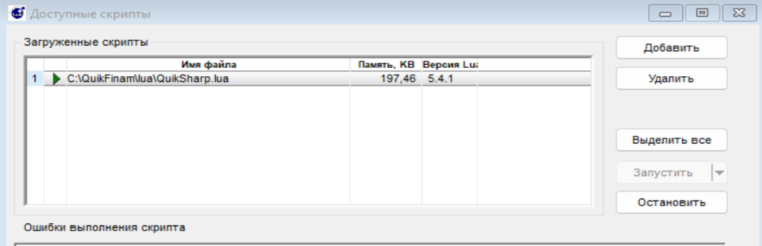

# Робот для торговли фьючерсами на бирже ММВБ. При подключении с помощью терминала QUIK.

## "Внимание! Данный робот создан в рамках дипломного проекта, не тестировался на реальных торгах. Запуская данного бота в реальной торговле. Вы должны понимать все риски которые можете понести."

### При написании данного кода были использованы библиотеки QuikPy и BackTraderQuik написанные Игорем Чечетом в рамках проекта Финансовая Лаборатория.

## Стратегия используемая роботом.

- На 4-х часовом таймфрейме определяем движение цены при помощи схождения и расхождения 
линий (сигнальной и MACD) индикатора MACD. 
- На 15-ти минутном графике, индикаторами stochastic и
RSI находим точки входа в позицию и выхода из неё. Если 4-х часовой график показывает покупку,
то только покупаем и наоборот.
- - Точка входа в покупку - пересечение линией %K индикатора stochastic снизу вверх линию %D
и значение индикатора RSI больше или равно 50.
- - Точка входа в продажу - пересечение линией %K индикатора stochastic сверху вниз линию %D
и значение индикатора RSI меньше или равно 50.
- - Выход из позиции является обратным действием входу (на 15-ти минутном графике, не 
обращая внимание на старший таймфрейм).

## Установка торгового робота.
### "У Вас должен быть установлен терминал QUIK!!!"

- Клонируем репозиторий с адреса: https://github.com/IIAndreyII/graduation_project
- Копируем папки lua и socket в папку установки терминала QUIK.

- 
- Запускаем QUIK и в меню Сервисы выбираем LUA скрипты. Добавляем скрипт QuikSharp.lua и запускаем его.
- 
- Так как разные брокеры используют различные версии терминала QUIK, то может появиться ошибка связанная с версией файла core.dll, различные версии этого файла можно найти по адресу https://github.com/finsight/QUIKSharp/tree/master/src/QuikSharp/lua/clibs64 методом перебора находим подходящую версию файла.

- 
- Для проверки работоспособности запускаем файл '04_Bars.py' получив заодно исторические данные по интересующему нас действующему фьючерсу 
(на данный момент действующий фьючерс на акции ВТБ имеет код "VBH4")
- 

  вставляем в строке 96 код фьючерса и запустив код в консоли получаем записи о произведенных действиях
-  

  а также в папке Data появятся файлы с историческими данными по фьючерсу VBH4
  
- 

## Тестирование Робота на исторических данных.

- Первое тестирование проводим с рекомендуемыми авторами индикаторов параметрами: MACD(12,26,9),
RSI(14), Stochastic Oscillator(14,3).
- - В файле 'bot_test_history.py' устанавливаем данные параметры

- 

  также указываем код фьючерса и временной период на данных которого будем проверять работу бота

- 

  после чего запускаем файл.

## Оптимизация робота.

- Поочередно меняя параметры по примеру в тестировании робота на исторических данных
в файлах 'optimiz_bot_macd.py', 'optimiz_bot_rsi.py', 'optimiz_bot_stoch.py'
получаем оптимальные параметры индикаторов торговой системы.

## Подключение к реальной торговле.

- В файле trader.py устанавливаем полученные оптимальные параметры. Также прописываем ('Код клиента',
'Код фирмы' - предоставляются брокером) и указываем код фьючерса по которому будет происходить торговля.
- 

- Запустив файл trader.py в консоли мы увидим отображение информации о работе бота.
- 